# Sakalava Tours — API

API backend de [Sakalava Tours](https://sakalavatours.com), agence de voyage basée à Nosy Be, Madagascar. Elle sert de source de vérité pour le catalogue de produits touristiques (circuits, excursions), les réservations, les avis clients, le contenu multilingue (FR/EN/DE/IT), le blog et la médiathèque, consommés par un frontend Next.js séparé.

## Approche / philosophie

Le code applique quelques règles strictes, documentées directement dans les modèles :

- **Fail fast au démarrage.** Le `lifespan` de FastAPI vérifie que PostgreSQL et Redis répondent avant de servir la moindre requête. Si l'un des deux est injoignable, le processus s'arrête net — sur le VPS, l'orchestrateur relance le conteneur au lieu de le laisser servir des 500 pendant des heures.
- **Configuration validée, pas devinée.** Toutes les variables d'environnement passent par un `Settings` Pydantic. Une variable requise manquante fait planter le lancement immédiatement, plutôt que de provoquer un `None` inexpliqué en pleine nuit.
- **Séparation stricte public / admin.** Chaque domaine métier (products, bookings, reviews, contact, media, taxonomies) a un routeur public et un routeur admin distincts, sous des préfixes différents. Documentation interactive (`/docs`, `/redoc`) coupée en production.
- **Contenu multilingue par table de traduction, pas par colonnes JSON.** Chaque entité de contenu suit le même patron : une table porteuse + une table `*Translation` par locale (`TranslationMixin`). Permet l'indexation full-text par langue et la traduction partielle.
- **Snapshot du prix à la réservation.** `Booking` ne référence jamais uniquement le produit : `product_slug`, `product_title`, `unit_price` sont figés à la création. Si le tarif change six mois plus tard, le montant facturé reste justifiable.
- **Aucun changement de statut sans trace.** Toute transition de `Booking.status` écrit une ligne dans `BookingStatusHistory` — qui a confirmé, et quand, est la première question posée en cas de litige.
- **Suppression douce.** `SoftDeleteMixin` équipe les entités indexées par Google (produits, avis, médias, pages...) : on ne supprime jamais physiquement un contenu qui a un slug référencé ailleurs.
- **Continuité SEO.** `SlugHistory` trace tout changement de slug et alimente une redirection 301 ; `Redirect` complète pour les URL de l'ancien site sans équivalent direct. Sans ce mécanisme, un simple renommage détruit le référencement acquis.
- **Avis vérifiés uniquement.** Seuls les avis `APPROVED` **et** `is_verified` (rattachés à une réservation réelle) alimentent le `aggregateRating` du JSON-LD. Les avis négatifs ne se suppriment jamais.
- **Traçabilité admin.** `AuditLog` enregistre l'état avant/après de chaque écriture sensible du back-office.
- **Mode dégradé pour l'email en dev.** Si `SMTP_HOST` est vide, les emails s'affichent dans les logs au lieu d'être envoyés.

## Installation

### Prérequis

- Python 3.12+
- PostgreSQL
- Redis
- Docker (recommandé, `docker-compose.yml` fourni)

### Variables d'environnement

Créer un fichier `.env` à la racine de `apps/api` avec au minimum :

```env
POSTGRES_USER=...
POSTGRES_PASSWORD=...
POSTGRES_DB=...
POSTGRES_HOST=localhost
POSTGRES_PORT=5432

REDIS_URL=redis://localhost:6379/0

SECRET_KEY=...        # openssl rand -hex 32

CORS_ORIGINS=["http://localhost:3000"]
```

Voir `src/core/config.py` pour la liste complète (email/SMTP, stockage Cloudflare R2, revalidation Next.js, garde-fous d'upload).

### Avec Docker

```bash
docker compose up --build
```

### Sans Docker

```bash
python -m venv .venv
source .venv/bin/activate
pip install -r requirements.txt

alembic upgrade head

uvicorn src.main:app --reload
```

## Utilisation

- Sonde de disponibilité : `GET /health` — vérifie réellement la connexion PostgreSQL et Redis.
- Toutes les routes métier sont préfixées par `/api/v1`, séparées en `/public/...` et `/admin/...`.
- Documentation interactive (`/docs`, `/redoc`) disponible uniquement hors production.

## Architecture

```
src/
├── api/
│   ├── public/       # Routes du site public (produits, réservations, avis, contact, sitemap, redirects)
│   └── admin/        # Routes du back-office (auth, produits, réservations, avis, médias, taxonomies, contact)
├── core/             # Configuration, connexion DB, Redis, sécurité (JWT/hash)
├── integrations/      # Services externes : email (SMTP), messages, stockage (Cloudflare R2)
├── models/            # Entités SQLModel (tables + mixins partagés)
├── repositories/       # Accès données bas niveau
├── schemas/            # Schémas Pydantic d'entrée/sortie de l'API
├── services/           # Logique métier (réservations, produits, avis, audit, revalidation...)
└── scripts/            # Scripts ponctuels (seed de données)
```

Authentification admin par JWT (access token court + refresh token — voir `ACCESS_TOKEN_MINUTES` / `REFRESH_TOKEN_DAYS`).

## Modèle de données

Tous les modèles combinent des **mixins partagés** (`src/models/base.py`) :

| Mixin | Rôle |
|---|---|
| `UUIDMixin` | Clé primaire UUID (pas d'ID séquentiel qui expose le volume d'activité) |
| `TimestampMixin` | `created_at` / `updated_at`, gérés côté PostgreSQL |
| `SoftDeleteMixin` | Suppression logique |
| `SlugMixin` | Slug unique, jamais modifié sans passer par `SlugHistory` |
| `PublishableMixin` | Cycle `is_published` / `published_at` / `sort_order` |
| `SeoMixin` | Meta title/description/OG — sur les tables de **traduction** |
| `SeoTechnicalMixin` | Indexation, canonical, sitemap — sur la table **parente** |
| `TranslationMixin` | Base des tables `*Translation` (`locale`, `is_machine_translated`) |

### Diagramme (entités principales)

```mermaid
erDiagram
    PRODUCT ||--o{ PRODUCT_TRANSLATION : "par langue"
    PRODUCT ||--o{ PRODUCT_ITINERARY_ITEM : "programme"
    PRODUCT ||--o{ PRODUCT_PRICE_TIER : "grille tarifaire"
    PRODUCT ||--o{ PRODUCT_FAQ : "FAQ"
    PRODUCT }o--|| DESTINATION : "localisé à"
    PRODUCT }o--o{ HIGHLIGHT : "points forts"
    PRODUCT }o--o{ INCLUSION : "prestations"
    PRODUCT }o--o{ PACKING_ITEM : "à prévoir"
    PRODUCT }o--o{ MEDIA : "galerie"
    PRODUCT ||--o{ PRODUCT_RELATED : "maillage interne"
    PRODUCT ||--o{ REVIEW : "avis"
    PRODUCT ||--o{ BOOKING : "snapshot au moment de la résa"

    DESTINATION ||--o{ DESTINATION_TRANSLATION : "par langue"
    DESTINATION ||--o{ DESTINATION : "hiérarchie (parent_id)"

    BOOKING ||--o{ BOOKING_STATUS_HISTORY : "historique des transitions"
    BOOKING }o--|| ADMIN_USER : "assigné à"

    REVIEW }o--|| ADMIN_USER : "modéré par"

    BLOG_POST ||--o{ BLOG_POST_TRANSLATION : "par langue"
    BLOG_POST }o--|| BLOG_CATEGORY : "catégorie"
    BLOG_POST }o--|| AUTHOR : "auteur"
    BLOG_POST }o--o{ PRODUCT : "maillage vers fiches produit"
    BLOG_POST }o--o{ BLOG_POST : "articles liés"
    AUTHOR }o--|| ADMIN_USER : "compte lié (optionnel)"

    PAGE ||--o{ PAGE_TRANSLATION : "par langue"
    PAGE ||--o{ PAGE_SECTION : "sections ordonnées"
    PAGE_SECTION ||--o{ PAGE_SECTION_TRANSLATION : "par langue"
    PAGE_SECTION ||--o{ PAGE_SECTION_ITEM : "items répétables"
    PAGE_SECTION_ITEM ||--o{ PAGE_SECTION_ITEM_TRANSLATION : "par langue"

    MEDIA ||--o{ MEDIA_TRANSLATION : "alt/caption par langue"
    GALLERY ||--o{ GALLERY_TRANSLATION : "par langue"
    GALLERY }o--o{ MEDIA : "album"

    ADMIN_USER ||--o{ AUDIT_LOG : "actions tracées"
    ADMIN_USER ||--o{ SLUG_HISTORY : "renommages"
```



*(Diagramme centré sur les relations principales — les tables de liaison à clé composite comme `PRODUCT_HIGHLIGHT` ou `PRODUCT_MEDIA` sont représentées par des `}o--o{` pour rester lisible.)*

### Domaines métier

- **Produits** (`product.py`) — table unique `Product` pour circuits ET excursions, discriminée par `product_type`/`product_format`. Satellites : `ProductItineraryItem`, `ProductPriceTier`, `ProductFaq` (alimente le JSON-LD FAQPage), `ProductHighlight`/`ProductInclusion`/`ProductPackingItem`/`ProductMedia`/`ProductRelated`/`ProductDepartureMonth`.
- **Taxonomies** (`taxonomy.py`) — `Destination` (seule à avoir ses propres pages indexables, avec hiérarchie parent/enfant), `Highlight`, `Inclusion`, `PackingItem`.
- **Réservations** (`booking.py`) — `Booking` (snapshot du prix, jalons, tracking UTM), `BookingStatusHistory`, `ContactMessage`.
- **Avis** (`review.py`) — `Review`, avec vérification d'email, `rejection_reason` obligatoire à tout rejet, anonymisation stricte des champs privés.
- **Blog** (`blog.py`) — `Author`, `BlogCategory`, `BlogPost`, `BlogPostProduct` (maillage vers les fiches produit), `BlogPostRelated`.
- **Médiathèque** (`media.py`) — `Media`, `MediaTranslation` (alt text obligatoire par langue), `Gallery`/`GalleryMedia`.
- **Pages CMS** (`page.py`) — `Page` composée de `PageSection` ordonnées, chacune avec ses `PageSectionItem` répétables.
- **Système** (`system.py`) — `AdminUser` (argon2, verrouillage après échecs), `AuditLog`, `Setting`/`SettingTranslation`, `SlugHistory`/`Redirect`, `RevalidationLog`.

## Migrations

Gérées avec Alembic (`alembic/versions/`) :

```bash
# Appliquer toutes les migrations en attente
alembic upgrade head

# Générer une migration après modification des modèles
alembic revision --autogenerate -m "description du changement"

# Revenir en arrière d'une révision
alembic downgrade -1
```

## Limites connues

- Pas encore de couverture de tests automatisés (`tests/` ne contient qu'un `__init__.py`).
- Ajouter un nouveau *type* de section de page (`PageSectionType`) nécessite du code des deux côtés (enum + composant React associé).
- `Product.rating_average` et `review_count` sont recalculés par la couche applicative, pas par une contrainte ou un trigger PostgreSQL — une écriture directe en base désynchronise ces compteurs tant que le service de recalcul n'est pas rejoué.
- Le rapprochement avis ↔ réservation (`is_verified`) passe par `booking_reference` saisi manuellement par le voyageur : une faute de frappe empêche la vérification automatique.

## Roadmap

<!-- à compléter -->
