# Sakalava Tours — Web

Frontend Next.js du site [sakalavatours.com](https://sakalavatours.com), vitrine et espace de réservation de l'agence de voyage Sakalava Tours à Nosy Be, Madagascar. Consomme l'API [sakalavatours-api](../api) pour le catalogue produits, les réservations, les avis clients et le contenu CMS, en multilingue (FR/EN/DE/IT).

## Approche / philosophie

- **BFF (Backend For Frontend) via les routes API Next.js.** `app/api/admin/*` et `app/api/stripe/*` ne contiennent pas de logique métier : elles font relais vers l'API FastAPI, ce qui garde les secrets (clés, tokens) hors du bundle client et permet de gérer l'authentification admin par cookies plutôt que par un token exposé côté navigateur.
- **Lecture publique tolérante, lecture critique stricte.** `getProducts()` (liste) utilise `apiGetSafe` : si l'API est injoignable, la page s'affiche vide plutôt que de faire échouer le build Vercel. `getProduct()` (fiche détail) ne rattrape que le 404 — une autre erreur remonte volontairement, car mieux vaut un build en échec qu'une fiche produit vide servie à un visiteur.
- **Contrat de types manuel avec le backend.** Les types dans `lib/api/*.ts` et `types/api.d.ts` reflètent exactement les schémas Pydantic de l'API. C'est un choix assumé plutôt qu'un contrat généré automatiquement — voir Limites connues.
- **Revalidation par tags, pas par intervalle fixe.** Chaque appel API (`getProducts`, `getProduct`...) passe des `tags` (`["products", "product:{slug}"]`). Le webhook `app/api/revalidate` déclenché par le back-office FastAPI invalide précisément les pages concernées, sans attendre un ISR à intervalle.
- **SEO structuré en JSON-LD.** Le dossier `lib/schema/` (`touristTrip`, `travelAgency`, `faqPage`, `breadcrumb`, `videoObject`) construit les données structurées schema.org à partir du contenu de l'API — pas de balisage statique déconnecté du contenu réel.
- **i18n au niveau du routing.** `next-intl` avec un segment `[locale]` : chaque page publique existe nativement dans les 4 langues supportées, avec fallback de contenu géré côté API (`is_fallback` / `content_locale` dans les réponses produits).
- **Paiement Stripe séparé client/serveur.** `lib/stripe/client.ts` (Stripe.js navigateur) et `lib/stripe/server.ts` (création de session, clé secrète) ne partagent aucun code — impossible d'exposer accidentellement la clé secrète au bundle client.

## Installation

### Prérequis

- Node.js 20+
- npm

### Variables d'environnement

Créer un fichier `.env.local` à la racine de `apps/web`. Les noms exacts sont définis dans `lib/api/client.ts` et `proxy.ts` — a minima, prévoir :

- l'URL de base de l'API FastAPI consommée par `apiGet` / `apiGetSafe`
- les clés Stripe (publique pour `lib/stripe/client.ts`, secrète pour `lib/stripe/server.ts`)
- le secret partagé avec le webhook `app/api/revalidate` (doit correspondre à `NEXTJS_REVALIDATE_SECRET` côté API)

### Lancer le projet

```bash
npm install
npm run dev
```

Build de production :

```bash
npm run build
npm run start
```

Lint :

```bash
npm run lint
```

## Utilisation

- Pages publiques sous `app/[locale]/...` : accueil, circuits, excursions, à propos, blog, galerie, avis, contact, réservation.
- Back-office sous `app/admin/...`, protégé par `RequireAuth` / `AuthContext`, authentifié via les routes `app/api/admin/auth/*` (login, refresh, me, logout).
- Toute écriture admin (produits, réservations, avis, médias, taxonomies, messages) passe par une route `app/api/admin/*` qui relaie vers l'API FastAPI.

## Architecture

```
src/
├── app/
│   ├── admin/          # Back-office : dashboard, produits, réservations, avis, médias, taxonomies, messages
│   ├── api/
│   │   ├── admin/       # Relais BFF vers l'API FastAPI (auth, bookings, media, messages, products, reviews, taxonomies)
│   │   ├── bookings/    # Création de réservation (public)
│   │   ├── contact/     # Formulaire de contact (public)
│   │   ├── revalidate/  # Webhook appelé par le back-office FastAPI
│   │   ├── reviews/     # Soumission + vérification d'avis (public)
│   │   └── stripe/      # checkout + webhook
│   └── [locale]/        # Pages publiques (une arborescence par langue via next-intl)
├── components/          # Organisés par domaine : admin, booking, circuits, contact, excursions, home, layout, products, reviews, ui
├── i18n/                # Configuration next-intl (routing, navigation, request)
├── lib/
│   ├── api/             # Client HTTP + un module par ressource (products, circuits, bookings, reviews, contact, admin-*)
│   ├── schema/           # Générateurs de données structurées JSON-LD (schema.org)
│   ├── stripe/            # Client (navigateur) et serveur (clé secrète), strictement séparés
│   └── constants/          # Enums partagés avec le backend (product-enums.ts)
├── messages/             # Traductions next-intl (fr, en, de, it)
└── proxy.ts              # Point d'entrée du proxy vers l'API (remplace le middleware historique)
```

## Contrats d'API (types miroir)

Chaque ressource métier a son module dans `lib/api/` avec ses types TypeScript, recopiés à la main depuis les schémas Pydantic de l'API :

- `products.ts` / `admin-products.ts` — catalogue public et gestion admin des circuits/excursions
- `circuits.ts` — vue spécialisée circuits
- `bookings.ts` / `admin-bookings.ts` — réservations, historique de statut, transitions
- `reviews.ts` / `admin-reviews.ts` — avis publics et modération
- `contact.ts` — messages de contact
- `admin-messages.ts` — gestion admin des messages
- `admin-taxonomies.ts` — destinations, points forts, inclusions, à prévoir
- `client.ts` — wrapper HTTP commun (`apiGet`, `apiGetSafe`, `ApiError`)
- `product-transform.ts` — normalisation des réponses API vers les formats attendus par les composants

## Limites connues

- Les types de `lib/api/*.ts` et `types/api.d.ts` sont maintenus à la main en miroir des schémas Pydantic de l'API — aucune génération automatique (pas d'OpenAPI codegen). Une modification d'un schéma côté backend sans répercussion ici casse silencieusement le typage, pas le build.
- `getRelatedProducts()` fait un appel HTTP par slug lié (2 à 4 en pratique) plutôt qu'un endpoint batch — accepté tant que le nombre reste faible.
- Le rendu multilingue dépend du fallback de contenu côté API (`is_fallback`) : une page peut afficher du contenu dans une autre langue que celle demandée sans que ce soit visuellement signalé partout.

# Sakalava Tours — API

API backend de [Sakalava Tours](https://sakalavatours.com), agence de voyage basée à Nosy Be, Madagascar. Elle sert de source de vérité pour le catalogue de produits touristiques (circuits, excursions), les réservations, les avis clients, le contenu multilingue (FR/EN/DE/IT), le blog et la médiathèque, consommés par un frontend Next.js séparé.

## Approche / philosophie

Le code applique quelques règles strictes, documentées directement dans les modèles :

- **Fail fast au démarrage.** Le `lifespan` de FastAPI vérifie que PostgreSQL et Redis répondent avant de servir la moindre requête. Si l'un des deux est injoignable, le processus s'arrête net — sur le VPS, l'orchestrateur relance le conteneur au lieu de le laisser servir des 500 pendant des heures.
- **Configuration validée, pas devinée.** Toutes les variables d'environnement passent par un `Settings` Pydantic. Une variable requise manquante fait planter le lancement immédiatement, plutôt que de provoquer un `None` inexpliqué en pleine nuit.
- **Séparation stricte public / admin.** Chaque domaine métier (products, bookings, reviews, contact, media, taxonomies) a un routeur public et un routeur admin distincts, sous des préfixes différents. Documentation interactive (`/docs`, `/redoc`) coupée en production.
- **Contenu multilingue par table de traduction, pas par colonnes JSON.** Chaque entité de contenu suit le même patron : une table porteuse + une table `*Translation` par locale (`TranslationMixin`). Permet l'indexation full-text par langue et la traduction partielle.
- **Snapshot du prix à la réservation.** `Booking` ne référence jamais uniquement le produit : `product_slug`, `product_title`, `unit_price` sont figés à la création. Si le tarif change six mois plus tard, le montant facturé reste justifiable.
- **Aucun changement de statut sans trace.** Toute transition de `Booking.status` écrit une ligne dans `BookingStatusHistory` — qui a confirmé, et quand, est la première question posée en cas de litige.
- **Suppression douce.** `SoftDeleteMixin` équipe les entités indexées par Google (produits, avis, médias, pages...) : on ne supprime jamais physiquement un contenu qui a un slug référencé ailleurs.
- **Continuité SEO.** `SlugHistory` trace tout changement de slug et alimente une redirection 301 ; `Redirect` complète pour les URL de l'ancien site sans équivalent direct. Sans ce mécanisme, un simple renommage détruit le référencement acquis.
- **Avis vérifiés uniquement.** Seuls les avis `APPROVED` **et** `is_verified` (rattachés à une réservation réelle) alimentent le `aggregateRating` du JSON-LD. Les avis négatifs ne se suppriment jamais.
- **Traçabilité admin.** `AuditLog` enregistre l'état avant/après de chaque écriture sensible du back-office.
- **Mode dégradé pour l'email en dev.** Si `SMTP_HOST` est vide, les emails s'affichent dans les logs au lieu d'être envoyés.

## Installation

### Prérequis

- Python 3.12+
- PostgreSQL
- Redis
- Docker (recommandé, `docker-compose.yml` fourni)

### Variables d'environnement

Créer un fichier `.env` à la racine de `apps/api` avec au minimum :

```env
POSTGRES_USER=...
POSTGRES_PASSWORD=...
POSTGRES_DB=...
POSTGRES_HOST=localhost
POSTGRES_PORT=5432

REDIS_URL=redis://localhost:6379/0

SECRET_KEY=...        # openssl rand -hex 32

CORS_ORIGINS=["http://localhost:3000"]
```

Voir `src/core/config.py` pour la liste complète (email/SMTP, stockage Cloudflare R2, revalidation Next.js, garde-fous d'upload).

### Avec Docker

```bash
docker compose up --build
```

### Sans Docker

```bash
python -m venv .venv
source .venv/bin/activate
pip install -r requirements.txt

alembic upgrade head

uvicorn src.main:app --reload
```

## Utilisation

- Sonde de disponibilité : `GET /health` — vérifie réellement la connexion PostgreSQL et Redis.
- Toutes les routes métier sont préfixées par `/api/v1`, séparées en `/public/...` et `/admin/...`.
- Documentation interactive (`/docs`, `/redoc`) disponible uniquement hors production.

## Architecture

```
src/
├── api/
│   ├── public/       # Routes du site public (produits, réservations, avis, contact, sitemap, redirects)
│   └── admin/        # Routes du back-office (auth, produits, réservations, avis, médias, taxonomies, contact)
├── core/             # Configuration, connexion DB, Redis, sécurité (JWT/hash)
├── integrations/      # Services externes : email (SMTP), messages, stockage (Cloudflare R2)
├── models/            # Entités SQLModel (tables + mixins partagés)
├── repositories/       # Accès données bas niveau
├── schemas/            # Schémas Pydantic d'entrée/sortie de l'API
├── services/           # Logique métier (réservations, produits, avis, audit, revalidation...)
└── scripts/            # Scripts ponctuels (seed de données)
```

Authentification admin par JWT (access token court + refresh token — voir `ACCESS_TOKEN_MINUTES` / `REFRESH_TOKEN_DAYS`).

## Modèle de données

Tous les modèles combinent des **mixins partagés** (`src/models/base.py`) :

| Mixin | Rôle |
|---|---|
| `UUIDMixin` | Clé primaire UUID (pas d'ID séquentiel qui expose le volume d'activité) |
| `TimestampMixin` | `created_at` / `updated_at`, gérés côté PostgreSQL |
| `SoftDeleteMixin` | Suppression logique |
| `SlugMixin` | Slug unique, jamais modifié sans passer par `SlugHistory` |
| `PublishableMixin` | Cycle `is_published` / `published_at` / `sort_order` |
| `SeoMixin` | Meta title/description/OG — sur les tables de **traduction** |
| `SeoTechnicalMixin` | Indexation, canonical, sitemap — sur la table **parente** |
| `TranslationMixin` | Base des tables `*Translation` (`locale`, `is_machine_translated`) |

### Diagramme (entités principales)

```mermaid
erDiagram
    PRODUCT ||--o{ PRODUCT_TRANSLATION : "par langue"
    PRODUCT ||--o{ PRODUCT_ITINERARY_ITEM : "programme"
    PRODUCT ||--o{ PRODUCT_PRICE_TIER : "grille tarifaire"
    PRODUCT ||--o{ PRODUCT_FAQ : "FAQ"
    PRODUCT }o--|| DESTINATION : "localisé à"
    PRODUCT }o--o{ HIGHLIGHT : "points forts"
    PRODUCT }o--o{ INCLUSION : "prestations"
    PRODUCT }o--o{ PACKING_ITEM : "à prévoir"
    PRODUCT }o--o{ MEDIA : "galerie"
    PRODUCT ||--o{ PRODUCT_RELATED : "maillage interne"
    PRODUCT ||--o{ REVIEW : "avis"
    PRODUCT ||--o{ BOOKING : "snapshot au moment de la résa"

    DESTINATION ||--o{ DESTINATION_TRANSLATION : "par langue"
    DESTINATION ||--o{ DESTINATION : "hiérarchie (parent_id)"

    BOOKING ||--o{ BOOKING_STATUS_HISTORY : "historique des transitions"
    BOOKING }o--|| ADMIN_USER : "assigné à"

    REVIEW }o--|| ADMIN_USER : "modéré par"

    BLOG_POST ||--o{ BLOG_POST_TRANSLATION : "par langue"
    BLOG_POST }o--|| BLOG_CATEGORY : "catégorie"
    BLOG_POST }o--|| AUTHOR : "auteur"
    BLOG_POST }o--o{ PRODUCT : "maillage vers fiches produit"
    BLOG_POST }o--o{ BLOG_POST : "articles liés"
    AUTHOR }o--|| ADMIN_USER : "compte lié (optionnel)"

    PAGE ||--o{ PAGE_TRANSLATION : "par langue"
    PAGE ||--o{ PAGE_SECTION : "sections ordonnées"
    PAGE_SECTION ||--o{ PAGE_SECTION_TRANSLATION : "par langue"
    PAGE_SECTION ||--o{ PAGE_SECTION_ITEM : "items répétables"
    PAGE_SECTION_ITEM ||--o{ PAGE_SECTION_ITEM_TRANSLATION : "par langue"

    MEDIA ||--o{ MEDIA_TRANSLATION : "alt/caption par langue"
    GALLERY ||--o{ GALLERY_TRANSLATION : "par langue"
    GALLERY }o--o{ MEDIA : "album"

    ADMIN_USER ||--o{ AUDIT_LOG : "actions tracées"
    ADMIN_USER ||--o{ SLUG_HISTORY : "renommages"
```



*(Diagramme centré sur les relations principales — les tables de liaison à clé composite comme `PRODUCT_HIGHLIGHT` ou `PRODUCT_MEDIA` sont représentées par des `}o--o{` pour rester lisible.)*

### Domaines métier

- **Produits** (`product.py`) — table unique `Product` pour circuits ET excursions, discriminée par `product_type`/`product_format`. Satellites : `ProductItineraryItem`, `ProductPriceTier`, `ProductFaq` (alimente le JSON-LD FAQPage), `ProductHighlight`/`ProductInclusion`/`ProductPackingItem`/`ProductMedia`/`ProductRelated`/`ProductDepartureMonth`.
- **Taxonomies** (`taxonomy.py`) — `Destination` (seule à avoir ses propres pages indexables, avec hiérarchie parent/enfant), `Highlight`, `Inclusion`, `PackingItem`.
- **Réservations** (`booking.py`) — `Booking` (snapshot du prix, jalons, tracking UTM), `BookingStatusHistory`, `ContactMessage`.
- **Avis** (`review.py`) — `Review`, avec vérification d'email, `rejection_reason` obligatoire à tout rejet, anonymisation stricte des champs privés.
- **Blog** (`blog.py`) — `Author`, `BlogCategory`, `BlogPost`, `BlogPostProduct` (maillage vers les fiches produit), `BlogPostRelated`.
- **Médiathèque** (`media.py`) — `Media`, `MediaTranslation` (alt text obligatoire par langue), `Gallery`/`GalleryMedia`.
- **Pages CMS** (`page.py`) — `Page` composée de `PageSection` ordonnées, chacune avec ses `PageSectionItem` répétables.
- **Système** (`system.py`) — `AdminUser` (argon2, verrouillage après échecs), `AuditLog`, `Setting`/`SettingTranslation`, `SlugHistory`/`Redirect`, `RevalidationLog`.

## Migrations

Gérées avec Alembic (`alembic/versions/`) :

```bash
# Appliquer toutes les migrations en attente
alembic upgrade head

# Générer une migration après modification des modèles
alembic revision --autogenerate -m "description du changement"

# Revenir en arrière d'une révision
alembic downgrade -1
```

## Limites connues

- Pas encore de couverture de tests automatisés (`tests/` ne contient qu'un `__init__.py`).
- Ajouter un nouveau *type* de section de page (`PageSectionType`) nécessite du code des deux côtés (enum + composant React associé).
- `Product.rating_average` et `review_count` sont recalculés par la couche applicative, pas par une contrainte ou un trigger PostgreSQL — une écriture directe en base désynchronise ces compteurs tant que le service de recalcul n'est pas rejoué.
- Le rapprochement avis ↔ réservation (`is_verified`) passe par `booking_reference` saisi manuellement par le voyageur : une faute de frappe empêche la vérification automatique.

